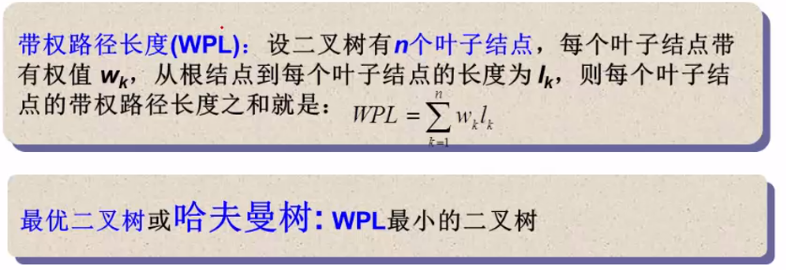
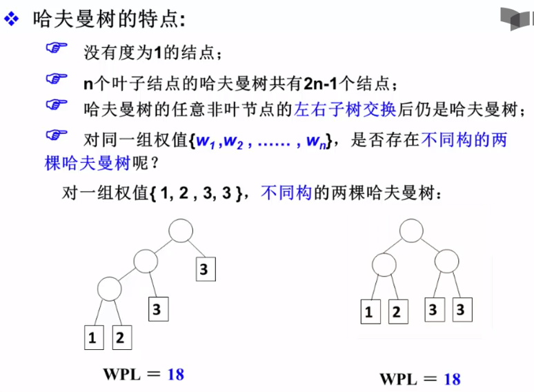

# Huffman树
## 什么是Huffman树

> 基本结构
```
typedef struct TreeNode* HuffmanTree;
struct TreeNode{
    int weight;
    HuffmanTree left,right;
}
bool operator < (HuffmanTree ht1,HuffmanTree ht2){
    return ht1.weight < ht2.weight;
}
priority_queue<HuffmanTree> MinHeap;
``` 
>构造Huffman树
```
HuffmanTree Huffman(MinHeap H){
    int len = H.size();
    buildMinHeap(H);  
    for (int i=1;i < len;i++){  // 做H.size()-1次合并
        HuffmanTree T = (HuffmanTree)new HuffmanNode();  
        T->left = H.top();  H.pop();
        T->right = H.top(); H.pop();
        T->weight = T->left->weight + T->right->weight;
        H.push(T);
    }
    T = H.top(); H.pop();
    return T;
}
```
> Huffman树的特点
