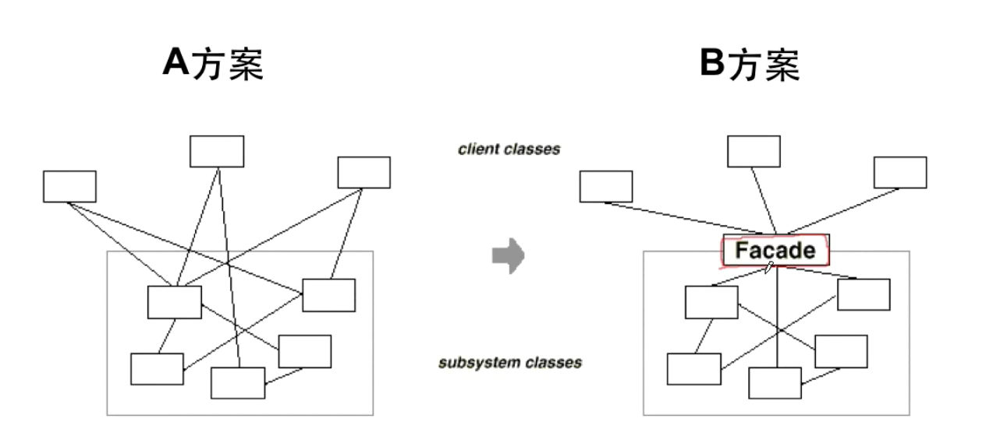

> ### 模式定义

> ### 要点总结
* 从客户程序的角度来看，`Facade模式`简化了整个组件系统的接口，
对于组件内部与外部客户程序来说，达到了一种“解耦”的效果-
内部子系统的任何变化不会影响到`Facade接口`的变化。
* `Facade`设计模式更注重从架构的层次去看整个系统，而不是单个
类的层次。`Facade`很多时候更是一种架构设计模式。
* `Facade`设计模式并非一个集装箱，可以任意地放进任何多个对象。
`Facade模式`中组件的内部应该是“相互耦合关系比较大的一系列组
件”，而不是一个简单的功能集合。
