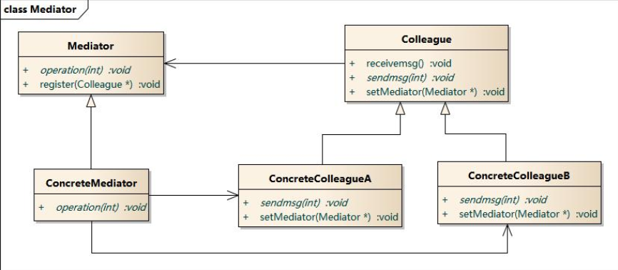
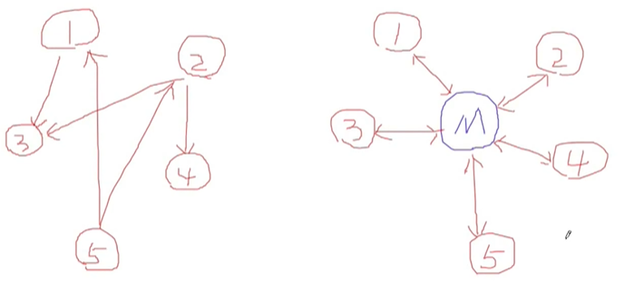

> ### 模式定义
> 用一个中介对象来封装(封装变化)一系列的对象交互。中
介者使各对象不需要显式的相互引用(编译时依赖>运行时
依赖)，从而使其耦合松散(管理变化)， 而且可以独立地
改变它们之间的交互。

### 中介者模式包含如下角色：

* Mediator: 抽象中介者
* ConcreteMediator: 具体中介者
* Colleague: 抽象同事类
* ConcreteColleague: 具体同事类

  
> ### 要点总结
* 将多个对象间复杂的关联关系解耦，`Mediator模式`将多个对象间的
控制逻辑进行集中管理，变“多个对象互相关联”为“多个对象和一个
中介者关联”，简化了系统的维护，抵御了可能的变化。
* 随着控制逻辑的复杂化，`Mediator`具体对象的实现可能相当复杂。
这时候可以对`Mediator对象`进行分解处理。
* `Facade模式`是`解耦系统间`(单向) 的对象关联关系; `Mediator`模
式是`解耦系统内各个对象之间`(双向)的关联关系。
