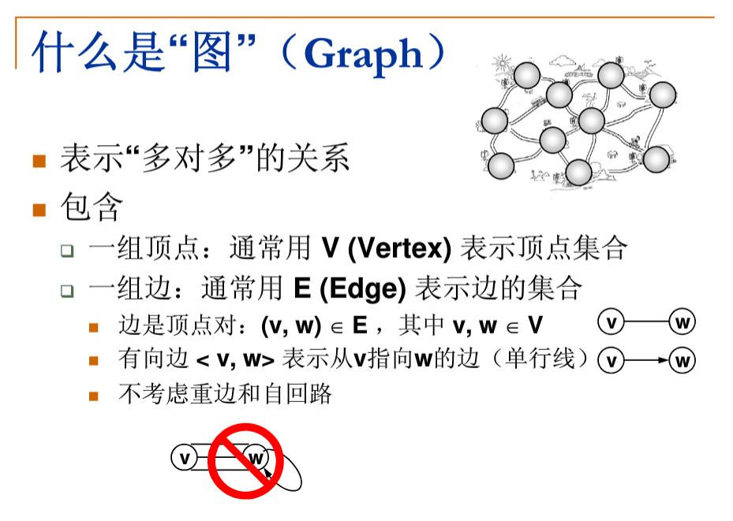
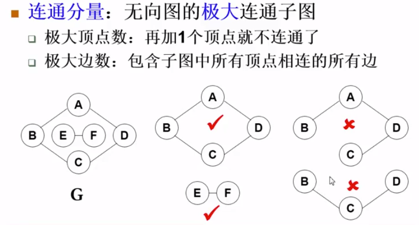
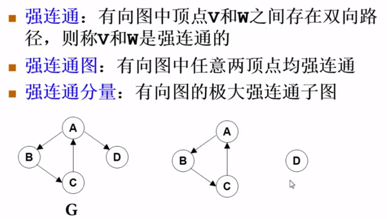

# 图
## 概念
> 
> 
> 
> 
## 图的表示方法
>  1. 邻接矩阵（二维数组） 
>  2. 使用一维数组（表示i到j的遍的下标为i(i+1)/2+j）
>  3. 邻接表（G[N]为指针数组，对应矩阵每行一个链表，只存非零元素）

## DFS(Depth First Search)
> 时间复杂度(N个定点 E条边)
>
> * 邻接表 O(N+E)
> * 临界矩阵 O(N^2)
```
void DFS(Vertes v){
    visited[v] = true;
    for ( v 的每个邻接点 w){
        if(!visites[w])
            DFS(w);
    }
}
```
## BFS(Breadth First Search)
> 时间复杂度参照DFS
```
queue<Vertes> Q;
void BFS(Vertes v){
    visited v;
    Q.push(v);    // q为队列
    while(!Q.empty()){
        V = Q.top(); Q.pop();
        for ( v 的每个邻接点 w){
            if(!visited[w]){
                visited[w] = true;
                Q.push(w);
            }
        } 
    }
}
```
> 遍历图里的每个连通分量
```
void ListCompoent(Graph G){
    for (each v in G){
        if(!visited){
            DFS(v); //BFS(v)
        }
    }
}
```